# Lucky Girls: Last Wall — 6개 지역 TD 기초 맵 설계 V1

작성: 2026-09-28 · 상태: **PROPOSAL / 검토용**

6개 지역에서 대표 스테이지를 하나씩 설계했다. Stage 1~6으로 지역을 재배정한 것이 아니다. 맵 이름·좌표·배치 수·경로별 웨이브 분배는 신규 제안이며, 기존 MASTER나 게임 파일은 변경하지 않았다.

## 기준과 충돌 처리

- 최우선 시각 기준: 사용자가 첨부한 Stage 1 구조 이미지. 높은 탑뷰 3/4, 절벽·수로·수목의 환경 밀도, 길/배치칸 대비를 참조한다. UI·캐릭터·하단 표는 복제하지 않는다.
- 로컬 기준: `D:\MYGAME\lucky_girls\03_DATA\REFERENCE\V4_2_WEEKEND_20260928\럭키_걸즈_캐릭터_도감_밸런스제안_V4_2_RPG실전규칙_HARD34-44통합-1.xlsx`.
- `TD_비주얼_맵_기준_V1!A4:F18`: 18×10, 경로와 배치 분리, 성채 CC/GG/CC, 1~4 진입로. `TD_그래픽품질_기준_V1!A4:G18`: 높은 탑뷰 3/4와 고밀도 SD 픽셀 환경.
- `스테이지_웨이브!A1:K501`에서 지역·스테이지·진입로 수와 W5/W10 이름을 읽었다. 문서의 수치를 엔진 검증 완료로 취급하지 않는다.
- **사용자 최신 지시 우선:** 배치 타일 내부 3슬롯을 유지한다. 기존 시트 A5:F6의 1칸 점유/중첩 금지와 다르므로 이번 초안은 D 타일 3슬롯을 기준으로 한다. C 방어칸도 도식에서는 3슬롯으로 제안 표시했지만, C의 실제 슬롯 정책은 구현 전 확인 항목이다. B 방벽칸과 G 성문은 일반 배치 슬롯으로 계산하지 않는다.
- 10웨이브, W5 중간보스, W10 TD 보스 격파 후 RPG 전환을 유지한다. 첨부 이미지 하단의 다른 웨이브 표는 반영하지 않는다. RPG 승리 전에는 최종 스테이지 클리어로 처리하지 않는다.
- 첨부 파일과 로컬 APPROVED PNG는 육안으로 같은 구성이지만 SHA-256은 다르다. 이번 시각 작업은 첨부 파일을 우선 참조했으며 파일명이 같다고 바이트 동일 원본으로 간주하지 않았다.

## 공통 플레이 규칙

격자 좌표는 좌상단 (1,1), 우하단 (18,10). 각 설계도의 선은 적의 진행 순서를 표시한다. 경로는 지정된 순서대로만 이동하고 인접 타일로 자동 지름길을 만들지 않는다. 지형 T에는 지역에 맞게 물·절벽·수목·폐허를 넣는다. 물 위 PATH는 다리로 표현한다. 세부 물/장애물 마스크는 후속 아트 단계에서 확정한다.

D와 C는 경로와 겹치지 않는다. B는 경로 위 지정 방벽 전용칸이며 일반 유닛으로 길막하지 않는다. 방벽 설치를 필수 정답으로 만들지 않는다. C 4칸 / G 2칸의 성채는 한 군데만 존재한다. 보스의 큰 외형은 논리 경로 폭을 바꾸지 않으며 절벽·성채에 가려지지 않아야 한다.

고저차는 우선 경로 및 배치 공간의 분리에 사용한다. 고지 사거리 증가, 날씨 감속, 시야 차단, 텔레포트는 확정 규칙이 아니므로 추가하지 않는다. 경로 길이는 그리드 이동 횟수이며 전투 시간이나 DPS 검증값이 아니다.

## 6개 맵 비교

|대표 스테이지|지역|진입로|Last Wall 위치|플레이 차이|
|---|---|---:|---|---|
|1|서부 왕국|1|우측 중앙|두 굽이 재공격|
|8|아자르 삼국연합|2|우측 상단|오아시스 양안 분산|
|13|해륜왕국|2|좌측 중앙|물로 갈라진 두 교량|
|18|벨로자르 제국|2|우측 하단|계단형 교전 구간 반복|
|23|생트아르크 교황령|3|우측 중앙|짧은 중앙길과 긴 측면길|
|30|상드라크 제국|4|중앙|사방 방어와 양측 문 앞 대응|

## Stage 1 · 서부 왕국 — 산악 초입의 길

- 지역 범위: Normal 1–5 / Hard 31–33
- 테마: 소나무·청회색 절벽·폭포와 목교. 기준 이미지의 산악 밀도와 길 대비를 가장 가깝게 계승한다.
- 핵심 선택: 두 굽이 안쪽에서 같은 적을 재공격하는 튜토리얼. 초입 집중 투자와 성문 보험 배치를 비교한다.
- 배치: D 12타일 × 3 = 36슬롯 + C 4칸(슬롯 정책 확인). [(4, 2), (7, 2), (12, 3), (3, 4), (9, 4), (16, 4), (5, 5), (10, 5), (7, 6), (15, 6), (3, 7), (9, 7)]
- 배치 의도: 첫 굽이 안쪽, 중앙 바위턱, 최종 굽이 외곽의 세 군집.
- 지형/고저차: 목교 아래 물은 이동 불가. 고지의 이점은 굽이를 가까이 보는 위치에서 발생하며 사거리 보너스는 없다.
- 방벽 B: [(10, 6)]
- W5: 최초의 골렘 아즈로 / W10: 철각왕 브라움 → RPG. 이름은 해당 Normal 대표 스테이지 원문값.
- 검증 초점: 중앙 한 곳에서 전 구간이 사거리 안에 들어오지 않도록 검증.

경로 1: (1,6) → (4,6) → (4,3) → (8,3) → (8,6) → (12,6) → (12,4) → (14,4) → (14,5) → (17,5) — 25칸 이동

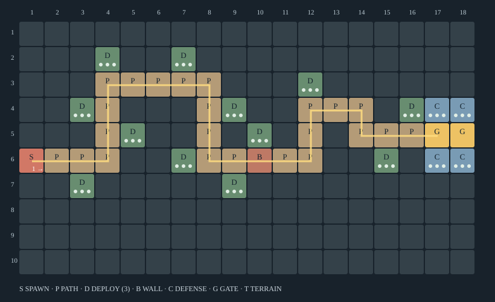

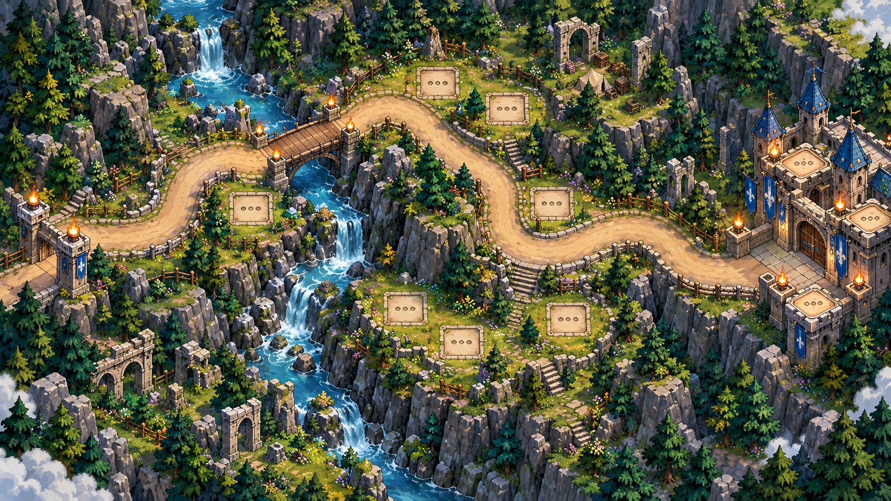

## Stage 8 · 아자르 삼국연합 — 오아시스 양안 방어선

- 지역 범위: Normal 6–10 / Hard 37–39
- 테마: 황토 사암·청록 오아시스·대상단 폐허. 중앙 수면으로 상하 방어 구역을 분리한다.
- 핵심 선택: 북쪽 조기 교전과 남쪽 후반 대응에 자원을 나눈다. 합류 이후가 짧아 성문 앞 몰빵이 불리하다.
- 배치: D 14타일 × 3 = 42슬롯 + C 4칸(슬롯 정책 확인). [(1, 1), (5, 1), (14, 1), (2, 3), (7, 3), (12, 3), (13, 4), (7, 5), (11, 5), (15, 6), (4, 7), (9, 7), (14, 7), (3, 9)]
- 배치 의도: 북쪽 사암 어깨와 남쪽 오아시스 제방을 별도 배치군으로 구성.
- 지형/고저차: 사암 턱과 사구는 배치 불가 경계. 모래 감속·모래폭풍 등 새 기믹은 넣지 않는다.
- 방벽 B: [(10, 4), (12, 6)]
- W5: 고위 정령 이프리트 / W10: 유리사막의 네프라 → RPG. 이름은 해당 Normal 대표 스테이지 원문값.
- 검증 초점: 양 경로 도달시간 차이를 실측해 빠른 쪽이 무조건 우선되는 현상을 방지.

경로 1: (1,2) → (5,2) → (5,4) → (11,4) → (11,2) → (16,2) — 19칸 이동

경로 2: (1,8) → (7,8) → (7,6) → (14,6) → (14,2) → (16,2) — 21칸 이동

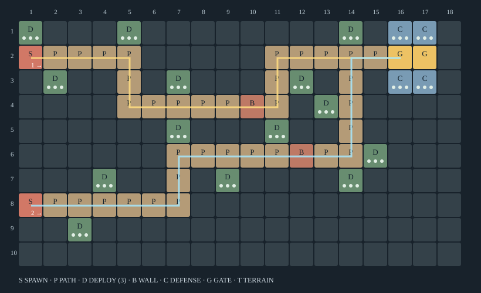

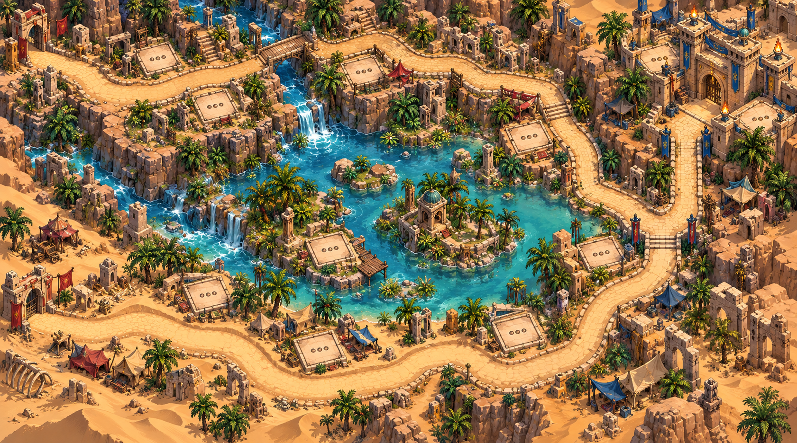

## Stage 13 · 해륜왕국 — 쌍교 항구 방어전

- 지역 범위: Normal 11–15 / Hard 40–42
- 테마: 청록 바다·돌제방·목재 부두·해륜풍 성루. 이동 방향을 우→좌로 뒤집는다.
- 핵심 선택: 상하 교량을 각각 지켜야 한다. 교량 앞 집중 화력과 항구 안쪽 누수 대응의 선택.
- 배치: D 14타일 × 3 = 42슬롯 + C 4칸(슬롯 정책 확인). [(13, 1), (17, 1), (8, 2), (10, 3), (16, 3), (4, 4), (7, 5), (11, 5), (9, 6), (4, 7), (8, 8), (13, 8), (18, 8), (14, 10)]
- 배치 의도: 독립된 방파제·섬의 모서리. 두 경로를 동시에 보는 공유 배치칸은 제한.
- 지형/고저차: 물 위에는 지정 교량만 PATH. 부두의 높이는 실루엣 차이로 보여주고 다리 밑 숨은 길은 없다.
- 방벽 B: [(10, 4), (9, 7)]
- W5: 심연의 고르라켄 / W10: 심해무녀 우미 → RPG. 이름은 해당 Normal 대표 스테이지 원문값.
- 검증 초점: 바다 장식이나 선박이 이동 가능한 제3 경로처럼 보이지 않게 한다.

경로 1: (18,2) → (13,2) → (13,4) → (8,4) → (8,3) → (5,3) → (5,5) → (2,5) — 21칸 이동

경로 2: (18,9) → (12,9) → (12,7) → (7,7) → (7,6) → (4,6) → (4,5) → (2,5) — 20칸 이동

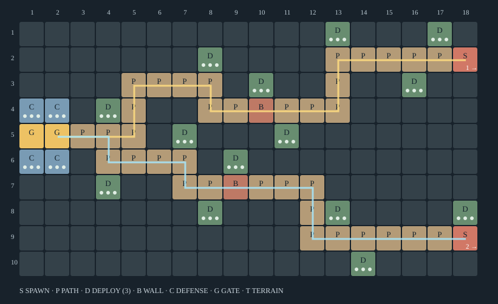

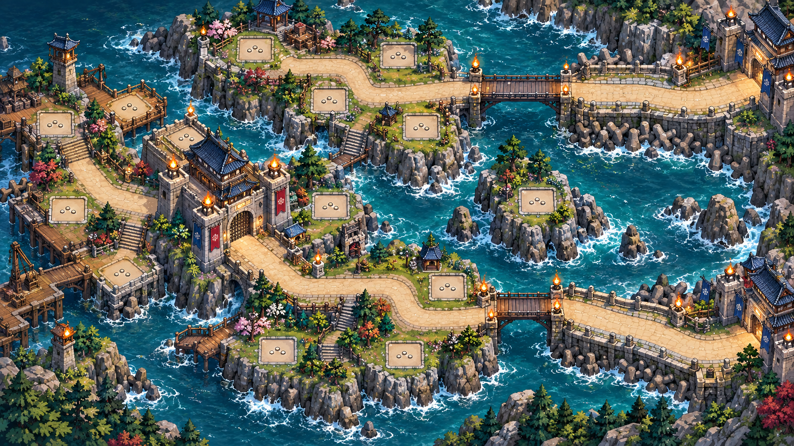

## Stage 18 · 벨로자르 제국 — 빙벽 계단 방어선

- 지역 범위: Normal 16–20 / Hard 34–36
- 테마: 백색 설원·청색 빙벽·검은 석재 계단. 좌우 능선에서 아래 성채로 내려온다.
- 핵심 선택: 계단 굽이별 짧은 교전 구간이 반복된다. 전방 두 능선과 하단 공통 방어선의 투자 비율을 결정.
- 배치: D 16타일 × 3 = 48슬롯 + C 4칸(슬롯 정책 확인). [(5, 1), (3, 2), (15, 2), (2, 3), (15, 3), (12, 4), (4, 5), (15, 5), (5, 6), (11, 6), (11, 7), (16, 7), (6, 8), (11, 8), (7, 9), (11, 10)]
- 배치 의도: 계단 안쪽 테라스에 분산. 장식 절벽은 유닛·배치칸을 가리지 않게 낮춘다.
- 지형/고저차: 위·중간·아래의 세 지형 단. 층간 경로는 계단으로 명시하며 점프·빙판 미끄럼은 없다.
- 방벽 B: [(6, 7), (14, 6)]
- W5: 무언의 사로스 / W10: 설해마녀 스카디아 → RPG. 이름은 해당 Normal 대표 스테이지 원문값.
- 검증 초점: 길이가 긴 왼쪽 경로가 공짜 대기시간이 되지 않도록 스폰 간격과 실교전 시간을 측정.

경로 1: (1,1) → (4,1) → (4,4) → (2,4) → (2,7) → (8,7) → (8,9) → (16,9) — 27칸 이동

경로 2: (18,1) → (13,1) → (13,4) → (16,4) → (16,6) → (12,6) → (12,9) → (16,9) — 24칸 이동

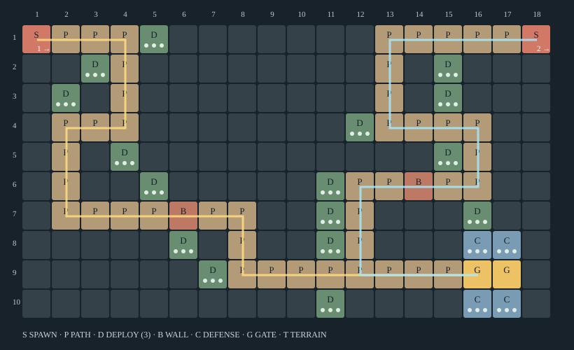

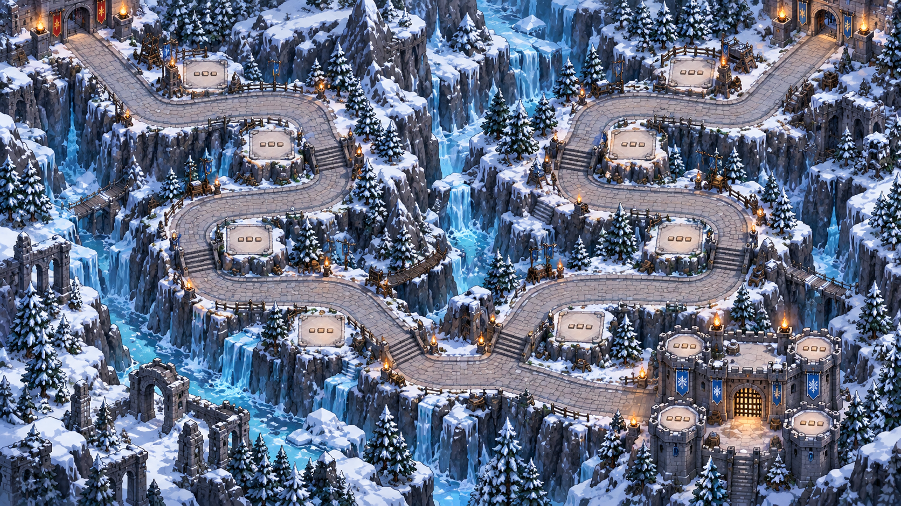

## Stage 23 · 생트아르크 교황령 — 세 회랑의 성역

- 지역 범위: Normal 21–25 / Hard 43–45
- 테마: 상아빛 회랑·바랜 금빛 모자이크·성상 잔해. 세 마당을 구분하되 중앙길을 비대칭으로 꺾는다.
- 핵심 선택: 중앙길은 짧고 측면 회랑은 길다. 중앙 대응과 양 측면의 지속화력을 함께 구성해야 한다.
- 배치: D 18타일 × 3 = 54슬롯 + C 4칸(슬롯 정책 확인). [(9, 1), (3, 2), (7, 2), (11, 2), (5, 3), (15, 3), (4, 4), (13, 4), (7, 5), (2, 6), (5, 6), (14, 6), (7, 7), (11, 7), (6, 8), (3, 9), (6, 9), (11, 9)]
- 배치 의도: 상부 회랑 안뜰, 중앙 분수 잔해 옆, 하부 묘지 테라스. 최종 합류점 배치 공간은 작게.
- 지형/고저차: 성역 기단과 회랑 단차. 기둥은 배치 금지 지형이며 시야 차단 전투 규칙은 추가하지 않는다.
- 방벽 B: [(12, 3), (8, 4), (11, 8)]
- W5: 기원의 대성상 / W10: 순교자 세베라 → RPG. 이름은 해당 Normal 대표 스테이지 원문값.
- 검증 초점: 중앙 속공로에만 투자하는 정답 또는 합류점 광역 한 곳으로 끝나는 정답을 모두 점검.

경로 1: (1,1) → (8,1) → (8,3) → (14,3) → (14,5) → (17,5) — 20칸 이동

경로 2: (1,5) → (5,5) → (5,4) → (10,4) → (10,5) → (17,5) — 18칸 이동

경로 3: (1,10) → (7,10) → (7,8) → (13,8) → (13,5) → (17,5) — 21칸 이동

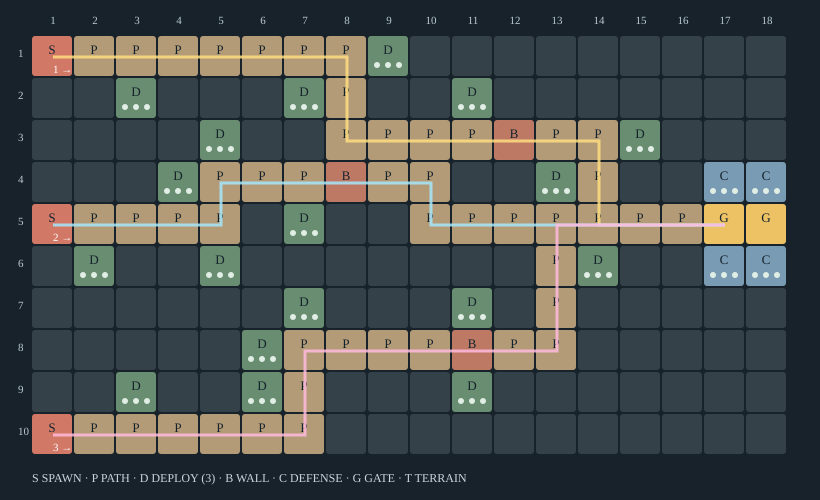

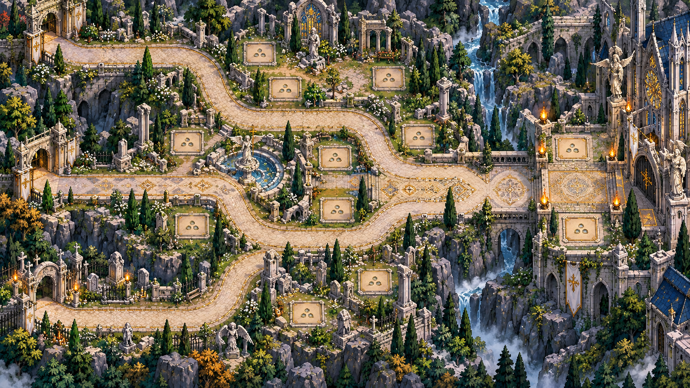

## Stage 30 · 상드라크 제국 — 균열 수도의 Last Wall

- 지역 범위: Normal 26–30 / Hard 46–50
- 테마: 흑색 제국 석재·황동 도관·절제된 보라 균열. 중앙 성채를 네 구역이 둘러싼다.
- 핵심 선택: 네 진입로를 두 문 앞 접근부로 늦게 합친다. 외곽 네 방어군과 중앙 최후 방어의 우선순위를 결정.
- 배치: D 20타일 × 3 = 60슬롯 + C 4칸(슬롯 정책 확인). [(6, 1), (1, 2), (4, 2), (12, 2), (16, 2), (4, 3), (11, 3), (6, 4), (13, 4), (8, 5), (6, 6), (4, 7), (8, 7), (14, 7), (8, 8), (1, 9), (3, 9), (7, 9), (14, 9), (18, 9)]
- 배치 의도: 네 폐허 섹터에 분산된 외곽 배치칸과 성채 C 4칸. 한 칸에서 사방을 모두 커버하지 못하게 한다.
- 지형/고저차: 마도 시설 기단과 균열 낭떠러지로 네 섹터 분리. 균열은 장애물이며 순간이동 경로가 아니다.
- 방벽 B: [(7, 4), (7, 7), (12, 4), (12, 7)]
- W5: 종말의 인도자 / W10: 균열군주 네메시스 → RPG. 이름은 해당 Normal 대표 스테이지 원문값.
- 검증 초점: 중앙 성채가 도로를 가리거나 서·동 접근이 같은 문 타일을 관통하는 표현을 방지.

경로 1: (1,1) → (5,1) → (5,3) → (7,3) → (7,6) → (9,6) — 13칸 이동

경로 2: (1,10) → (4,10) → (4,8) → (7,8) → (7,6) → (9,6) — 12칸 이동

경로 3: (18,1) → (14,1) → (14,3) → (12,3) → (12,6) → (10,6) — 13칸 이동

경로 4: (18,10) → (15,10) → (15,8) → (12,8) → (12,6) → (10,6) — 12칸 이동

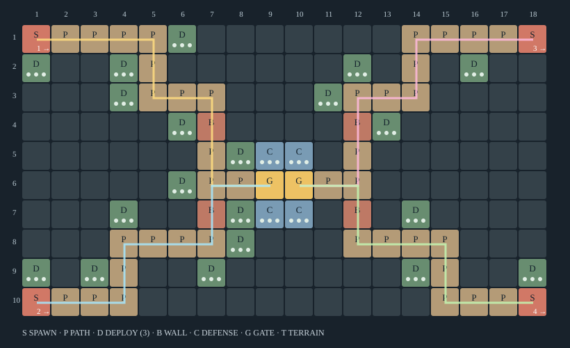

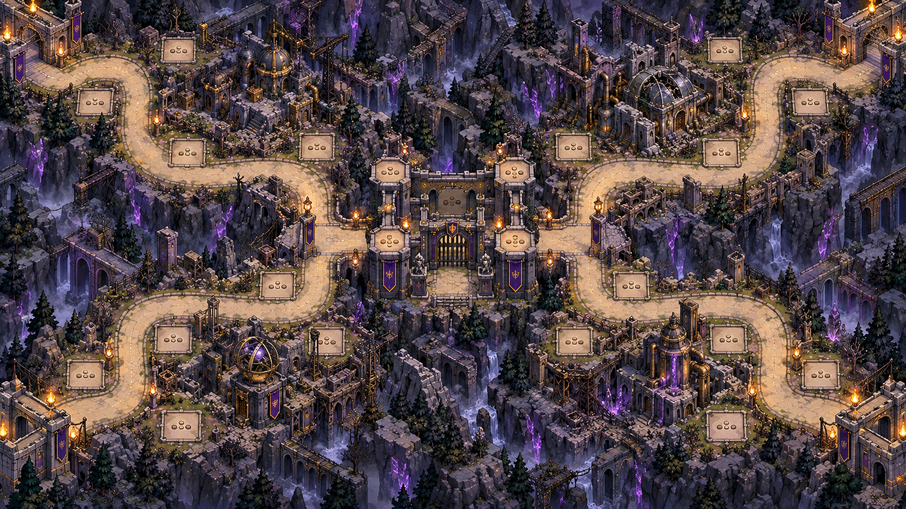

## 웨이브 운영 제안

기존 적 총수·능력치·스폰 간격은 변경하지 않고, 기존 웨이브의 적을 경로별로 나누는 방식만 제안한다. 각 맵은 첫 웨이브부터 해당 스테이지의 진입로 수를 유지한다.

|맵|W1–4|W5|W6–9|W10|
|---|---|---|---|---|
|서부|단일 경로의 앞·뒤 배치 학습|아즈로로 재공격 구간 점검|동일 길에서 누수 대응|브라움, 동일 경로|
|아자르|북/남 60:40 → 40:60 분배|북쪽 보스·남쪽 호위|양안 비중 교대|북쪽 보스·양안 호위|
|해륜|상/하 교량 균등 분배|상부 보스·하부 호위|양쪽 교량 지속 압박|하부 보스·상부 호위|
|벨로자르|좌우 계단 비중 교대|우측 보스·좌측 호위|하단 합류 전 분산 처치|좌측 보스·우측 호위|
|교황령|중앙 40%, 양쪽 각 30%|중앙 보스·회랑 호위|세 마당 동시 유지|상부 보스·중앙/하부 호위|
|상드라크|네 경로 약 25%씩|좌상 보스·나머지 호위|네 구역 투자 균형 점검|우하 보스·나머지 호위|

분배는 제안값이다. 정수 적 수 배분 시 남는 수량은 경로 번호 순으로 순환 배정하고 총수는 보존한다. TD 보스 HP 0 시 기존 전환 규칙을 사용한다. 전환 중 호위 처리·시간 정지는 기존 런타임 규칙 확인 후 연결한다.

## 지역 내 나머지 스테이지 확장

Normal 1–20의 각 지역 5개 맵 진입로는 1/1/2/2/3, Normal 21–30은 2/2/3/3/4를 따른다. 대표 맵을 색만 바꾸지 않고 지역 안에서도 첫 굽이 위치, 합류 거리, 배치 군집을 이동한다. Hard 재방문 순서는 서부 31–33 → 벨로자르 34–36 → 아자르 37–39 → 해륜 40–42 → 교황령 43–45 → 상드라크 46–50이며 Normal 순서를 그대로 반복하지 않는다. 이 패키지는 대표 6맵의 초안이며 50개 완성 맵이 아니다.

## 다음 구현 검증

좌표 구조 검사는 경로의 상하좌우 연결, 경계, 성문 도달, PATH/DEPLOY 분리, B의 경로 포함, 성채 CC/GG/CC를 대상으로 했다. 실제 게임의 사거리·적 속도·3슬롯 전투 밀도·보스 충돌·시야 가림·프레임 성능·승률은 검증 전이다. 특히 근접/원거리의 유효 사격시간, 최단 경로 도달시간, 합류점 몰빵 여부, 방벽 미사용 클리어 가능성을 실제 엔진에서 확인해야 한다.

컨셉 PNG는 재질·분위기·시점 검토용이다. 정확한 타일 수·경로·슬롯 위치·성채 구조의 기준은 SVG와 JSON이다. 생성 그림의 형상 차이를 새 규칙으로 승격하지 않는다.
